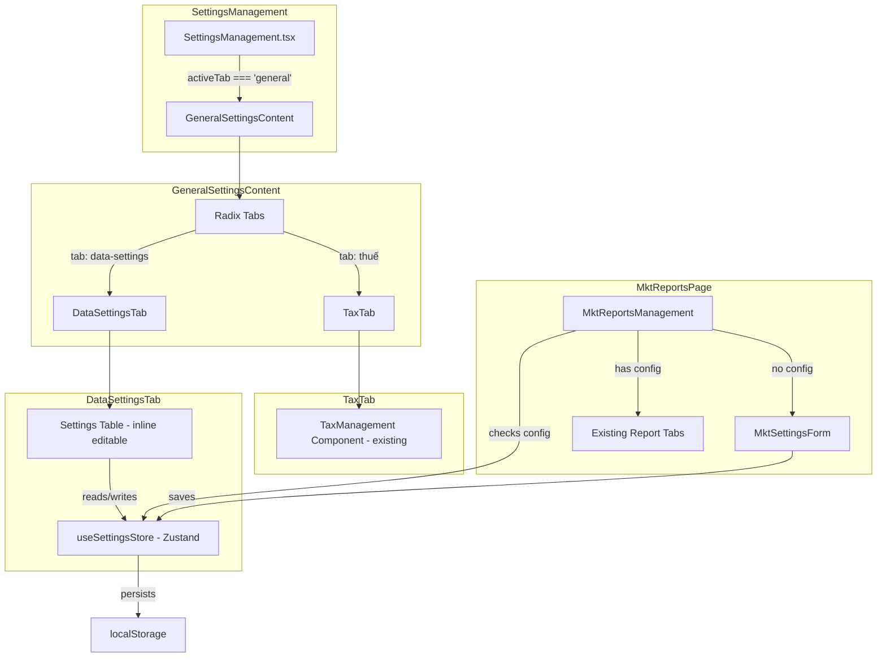

# Design Document: General Settings Tabs

## Overview

This design refactors the "Cài đặt chung" (General Settings) page from a collapsible-based layout to a tab-based layout using the existing Radix UI Tabs component. The page will contain two tabs: "Thuế" (Tax) and "Cài đặt dữ liệu" (Data Settings). Additionally, the MKT Reports page will integrate a settings form that gates access to reports when MKT configuration is missing, with bidirectional data synchronization between the MKT form and the Data Settings tab.

### Key Design Decisions

1. **Zustand store for shared MKT settings state** — Since MKT settings must be accessible from both the MKT Reports page and the Data Settings tab, a Zustand store provides the simplest cross-component state sharing without prop drilling or context providers.
2. **Inline editing pattern for Data Settings table** — Rather than modal-based editing, inline editing reduces context switching and matches the "quick configuration" mental model for settings.
3. **Reuse existing TaxManagement component as-is** — The Tax tab wraps the existing component without modification, preserving its local state and CRUD behavior.
4. **react-hook-form + zod for MKT Settings Form** — These libraries are already available in the project and provide robust validation with minimal boilerplate.

## Architecture



### Data Flow

1. **MKT Settings Form → Zustand Store → Data Settings Tab**: When a user saves MKT settings from the MKT Reports page, the Zustand store updates, and the Data Settings tab reactively displays the new rows.
2. **Data Settings Tab → Zustand Store → MKT Reports Page**: When a user edits an MKT setting inline in the Data Settings tab, the store updates, and the MKT Reports page uses the updated values on next access.
3. **localStorage persistence**: The Zustand store uses `persist` middleware to survive page refreshes.

## Components and Interfaces

### New Components

| Component | Path | Responsibility |
|-----------|------|----------------|
| `GeneralSettingsContent` | `app/components/settings/GeneralSettingsContent.tsx` | Renders Radix Tabs with "Thuế" and "Cài đặt dữ liệu" tabs |
| `DataSettingsTab` | `app/components/settings/DataSettingsTab.tsx` | Renders the settings table with inline editing |
| `MktSettingsForm` | `app/components/mkt-reports/MktSettingsForm.tsx` | Form for initial MKT configuration |

### New Store

| Store | Path | Responsibility |
|-------|------|----------------|
| `useSettingsStore` | `app/stores/useSettingsStore.ts` | Zustand store managing system settings (including MKT params) with localStorage persistence |

### Modified Components

| Component | Change |
|-----------|--------|
| `SettingsManagement.tsx` | Replace collapsible general section with `<GeneralSettingsContent />` |
| `MktReportsManagement.tsx` | Add conditional rendering: show `MktSettingsForm` when MKT not configured, else show reports |

### Component Interfaces

```typescript
// GeneralSettingsContent - no props needed, self-contained with tabs
export function GeneralSettingsContent(): JSX.Element

// DataSettingsTab - no props, reads from Zustand store
export function DataSettingsTab(): JSX.Element

// MktSettingsForm
interface MktSettingsFormProps {
  onSaveSuccess: () => void; // callback when form saves successfully
}
export function MktSettingsForm({ onSaveSuccess }: MktSettingsFormProps): JSX.Element
```

### Zustand Store Interface

```typescript
interface SettingItem {
  key: string;
  label: string;        // "Cài đặt" column
  description: string;  // "Mô tả" column
  value: string | number | boolean;
  type: 'STRING' | 'NUMBER' | 'BOOLEAN';
  category: 'system' | 'mkt';
}

interface SettingsState {
  settings: SettingItem[];
  mktConfigured: boolean;

  // Actions
  getSettingValue: (key: string) => string | number | boolean | undefined;
  updateSetting: (key: string, value: string | number | boolean) => void;
  saveMktSettings: (data: MktFormData) => void;
  isMktConfigured: () => boolean;
}

interface MktFormData {
  email: string;
  password: string;
  baseUrl: string;
  syncInterval: number;
}
```

### MKT Form Validation Schema (Zod)

```typescript
const mktSettingsSchema = z.object({
  email: z.string().min(1, 'Email là bắt buộc').email('Email không đúng định dạng'),
  password: z.string().min(1, 'Mật khẩu là bắt buộc').max(128),
  baseUrl: z.string()
    .min(1, 'Base URL là bắt buộc')
    .max(2048)
    .refine(
      (val) => val.startsWith('http://') || val.startsWith('https://'),
      'URL phải bắt đầu bằng http:// hoặc https://'
    ),
  syncInterval: z.number()
    .min(5, 'Chu kỳ tối thiểu 5 phút')
    .max(1440, 'Chu kỳ tối đa 1440 phút'),
});
```

## Data Models

### Settings Store Initial State

The store initializes with an empty settings array. MKT settings are added only after the user completes the MKT Settings Form.

```typescript
// Default system settings (always present)
const DEFAULT_SETTINGS: SettingItem[] = [];
// No default system settings initially - only MKT settings appear after configuration

// MKT settings template (added when MKT is configured)
const MKT_SETTINGS_TEMPLATE: Omit<SettingItem, 'value'>[] = [
  {
    key: 'mkt_login_email',
    label: 'MKT login email',
    description: 'Email đăng nhập hệ thống MKT',
    type: 'STRING',
    category: 'mkt',
  },
  {
    key: 'mkt_login_password',
    label: 'MKT login password',
    description: 'Mật khẩu đăng nhập hệ thống MKT',
    type: 'STRING', // rendered as password input
    category: 'mkt',
  },
  {
    key: 'mkt_base_url',
    label: 'MKT Base URL',
    description: 'Địa chỉ URL gốc của hệ thống MKT',
    type: 'STRING',
    category: 'mkt',
  },
  {
    key: 'mkt_sync_interval',
    label: 'MKT Chu kỳ đồng bộ',
    description: 'Chu kỳ đồng bộ dữ liệu từ MKT (phút)',
    type: 'NUMBER',
    category: 'mkt',
  },
];
```

### Inline Editing State (local to DataSettingsTab)

```typescript
interface EditingState {
  key: string | null;       // which row is being edited (null = none)
  tempValue: string | number | boolean; // temporary value during editing
  error: string | null;     // validation error message
  saving: boolean;          // loading state during save
  successKey: string | null; // key of row showing success toast (auto-clears after 3s)
}
```

### localStorage Schema

```typescript
// Key: 'vilead-settings-store'
// Value: Zustand persisted state
{
  state: {
    settings: SettingItem[];
    mktConfigured: boolean;
  },
  version: 0
}
```


## Correctness Properties

*A property is a characteristic or behavior that should hold true across all valid executions of a system — essentially, a formal statement about what the system should do. Properties serve as the bridge between human-readable specifications and machine-verifiable correctness guarantees.*

### Property 1: Correct input type renders based on setting type

*For any* setting item with a defined type (STRING, NUMBER, or BOOLEAN), when that row enters edit mode, the rendered input control SHALL match the type: a text input for STRING, a number input for NUMBER, and a switch for BOOLEAN.

**Validates: Requirements 3.3**

### Property 2: Action buttons reflect editing state

*For any* setting row in the Data Settings table, when the row is in display mode the actions column SHALL show an Edit button, and when the row is in edit mode the actions column SHALL show Save and Cancel buttons (and no Edit button).

**Validates: Requirements 3.2, 3.4**

### Property 3: Valid save updates store and returns to display mode

*For any* setting item and any valid value matching its type constraints (non-empty string for STRING, valid number for NUMBER, boolean for BOOLEAN), saving the value SHALL update the Zustand store with the new value and return the row to display mode.

**Validates: Requirements 3.5, 5.3**

### Property 4: Cancel restores original value

*For any* setting item being edited with any temporary value, clicking Cancel SHALL restore the displayed value to the original value from the store, unchanged.

**Validates: Requirements 3.6**

### Property 5: Invalid inline values are rejected with validation errors

*For any* STRING setting with an empty/whitespace-only value, or any NUMBER setting with a non-numeric value, attempting to save SHALL display a validation error message and SHALL NOT update the store value.

**Validates: Requirements 3.8**

### Property 6: MKT form save creates correct store entries

*For any* valid MKT configuration (valid email format, non-empty password ≤128 chars, URL starting with http:// or https:// ≤2048 chars, sync interval integer between 5 and 1440), saving via the MKT Settings Form SHALL result in exactly 4 setting items in the store with keys `mkt_login_email`, `mkt_login_password`, `mkt_base_url`, `mkt_sync_interval` and their corresponding submitted values.

**Validates: Requirements 4.4, 5.1**

### Property 7: Invalid MKT configuration is rejected with specific errors

*For any* MKT configuration where at least one field is invalid (email not matching email format, empty password, URL not starting with http:// or https://, sync interval outside 5-1440), the form SHALL NOT save and SHALL display at least one field-level validation error message identifying the specific issue.

**Validates: Requirements 4.5**

## Error Handling

### Inline Edit Save Failure (Data Settings Tab)

| Scenario | Behavior |
|----------|----------|
| Network/system error during save | Show error toast/message near the row, keep row in edit mode, preserve user's entered value |
| Validation error (empty STRING, invalid NUMBER) | Show inline error message below the value cell, keep row in edit mode, do NOT call store update |
| Concurrent edit attempt (another row already editing) | Prevent entering edit mode on second row; only one row editable at a time |

### MKT Settings Form Errors

| Scenario | Behavior |
|----------|----------|
| Field validation failure | Show field-level error message below each invalid field (red text, specific message) |
| System error on save | Show general error banner/toast above form, preserve all entered data |
| All fields empty on submit | Show required field errors on all 4 fields simultaneously |

### State Consistency

- If localStorage is corrupted or missing, the store initializes with default empty state (`mktConfigured: false`, empty settings array)
- If a setting key referenced in an edit doesn't exist in the store, the edit is silently ignored (defensive programming)

## Testing Strategy

### Unit Tests (Example-based)

| Test | Validates |
|------|-----------|
| GeneralSettingsContent renders 2 tabs in correct order | Req 1.1 |
| Default active tab is "Thuế" | Req 1.2 |
| Tab switching shows correct content | Req 1.3 |
| Tax tab renders TaxManagement component | Req 2.1 |
| MKT Reports page shows form when not configured | Req 4.1 |
| MKT Reports page shows reports when configured | Req 4.1 |
| Password field displays masked in display mode | Req 5.2 |
| MKT rows hidden when not configured | Req 5.5 |
| Save failure keeps row in edit mode with error | Req 3.7, 5.4 |
| System error on MKT form preserves data | Req 4.6 |

### Property-Based Tests

Property-based tests use `fast-check` (or equivalent JS PBT library available in the ecosystem). Each test runs a minimum of 100 iterations.

| Property Test | Validates | Strategy |
|---------------|-----------|----------|
| Input type matches setting type | Req 3.3 | Generate random SettingItems with random types, verify correct input renders |
| Action buttons reflect state | Req 3.2, 3.4 | Generate random settings, toggle edit mode, verify button presence |
| Valid save round-trip | Req 3.5, 5.3 | Generate random valid values per type, save, verify store updated |
| Cancel restores original | Req 3.6 | Generate random settings + random temp values, cancel, verify original restored |
| Invalid values rejected | Req 3.8 | Generate random invalid values (empty strings, non-numeric for NUMBER), verify rejection |
| MKT form save creates entries | Req 4.4, 5.1 | Generate random valid MKT configs, save, verify 4 store entries |
| Invalid MKT config rejected | Req 4.5 | Generate random invalid MKT configs, verify validation errors |

### PBT Library Choice

- **Library**: `fast-check` — the standard property-based testing library for TypeScript/JavaScript
- **Test Runner**: The project's existing test setup (or vitest if adding tests fresh)
- **Minimum iterations**: 100 per property
- **Tag format**: `Feature: general-settings-tabs, Property {N}: {title}`

### Integration Tests

| Test | Validates |
|------|-----------|
| Save MKT from form → rows appear in Data Settings tab | Req 5.1 |
| Edit MKT in Data Settings → MKT Reports uses new value | Req 5.3 |
| localStorage persistence survives page refresh | Store persistence |

